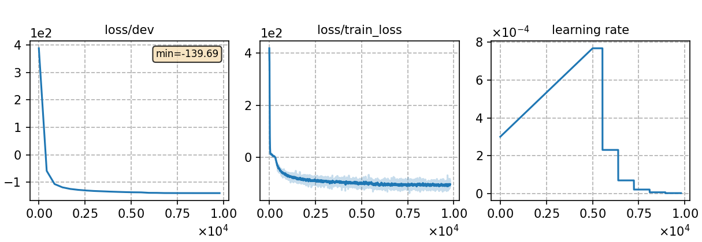

### Basic info

**This part is auto-generated, add your details in Appendix**

* \# of parameters (million): 13.39
* GPU info \[5\]
  * \[5\] NVIDIA GeForce RTX 3090

### Notes

* CTC-CRF training for around 23 epochs

### Result
```
eval92  %SER 29.73 | %WER 2.87 [ 162 / 5643, 14 ins, 14 del, 134 sub ]
dev93  %SER 46.32 | %WER 5.53 [ 455 / 8234, 49 ins, 52 del, 354 sub ]  

```

|     training process    |
|:-----------------------:|
||
