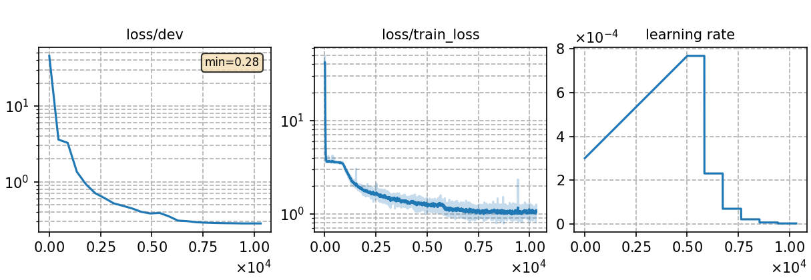

### Basic info

**This part is auto-generated, add your details in Appendix**

* \# of parameters (million): 13.39
* GPU info \[10\]
  * \[10\] NVIDIA GeForce RTX 3090

### Notes

* CTC trainging 23 epochs

### Result
```
eval92  %SER 51.49 | %WER 6.79 [ 383 / 5643, 30 ins, 54 del, 299 sub ]
dev93   %SER 69.77 | %WER 11.88 [ 978 / 8234, 60 ins, 211 del, 707 sub ]
```

|     training process    |
|:-----------------------:|
||
