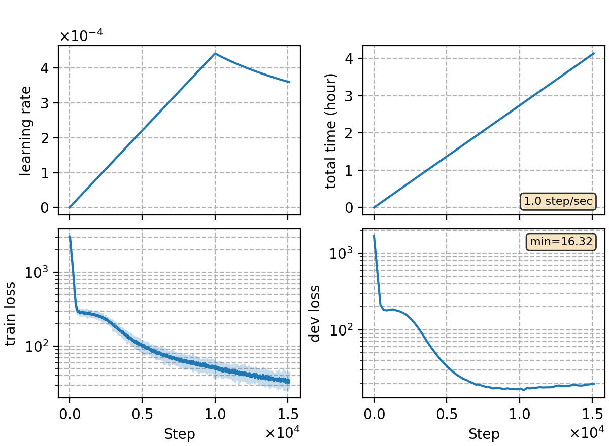

### Basic info

**This part is auto-generated, add your details in Appendix**

* \# of parameters (million): 21.60
* GPU info \[10\]
  * \[10\] NVIDIA GeForce RTX 3090

### Notes

```bash
# prepare data
bash local/data_kaldi.sh -use-3way-sp

# train and inference
python utils/pipeline/asr.py exp/asr-rnnt-bpe
```

* RNN-T training and Beam Search decoding

### Result
```
eval92  %SER 66.37 | %WER 9.87 [ 557 / 5643, 35 ins, 74 del, 448 sub ]
dev93   %SER 72.76 | %WER 12.63 [ 1040 / 8234, 103 ins, 174 del, 763 sub ]
```

|     training process    |
|:-----------------------:|
||
