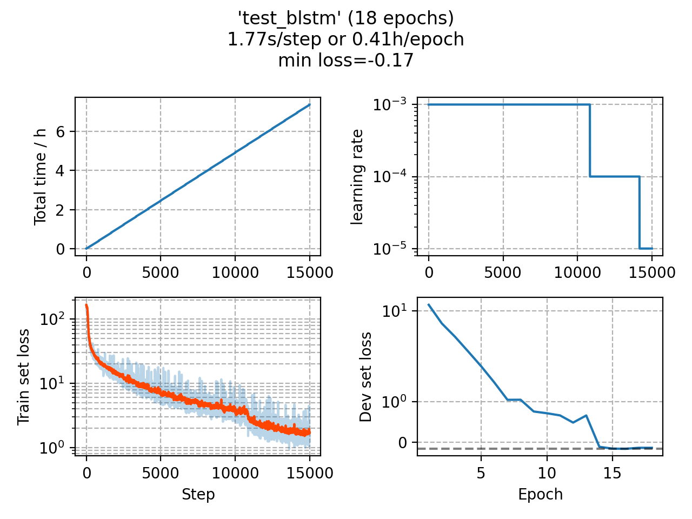

### Basic info

**This part is auto generated, add your details in Appendix**

* Model size/M: 13.49
* GPU info \[2\]
  * \[2\] GeForce GTX 1080 Ti

### Appendix

* 

### WER
```
%WER 3.65 [ 206 / 5643, 22 ins, 19 del, 165 sub ] exp/test_blstm/decode_eval92_bd_fgconst/wer_12_1.0
%WER 6.30 [ 519 / 8234, 62 ins, 72 del, 385 sub ] exp/test_blstm/decode_dev93_bd_fgconst/wer_16_0.0
```

### Monitor figure

