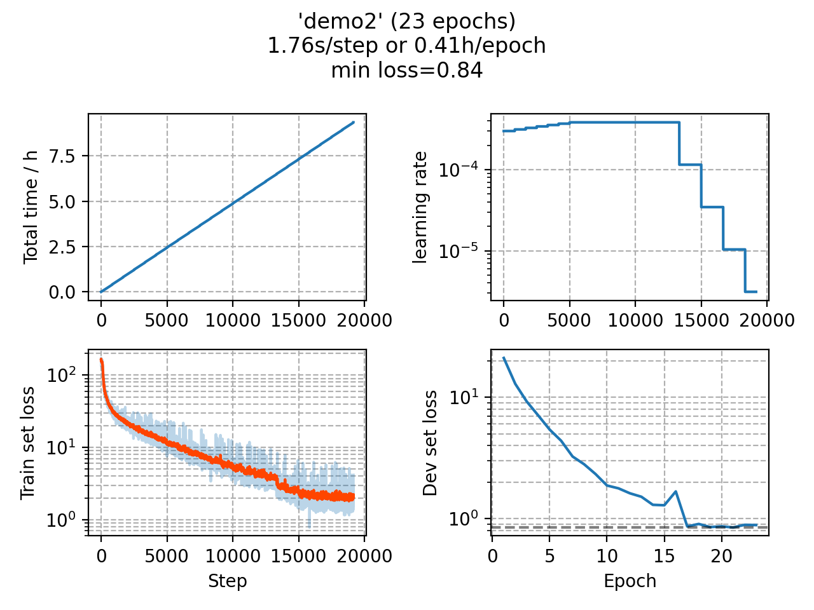

### Basic info

**This part is auto generated, add your details in Appendix**

* Model size/M: 13.49
* GPU info \[2\]
  * \[2\] GeForce GTX 1080 Ti

### Appendix

* This demo shows how to add SpecAug in training.

### WER
```
%WER 3.74 [ 211 / 5643, 27 ins, 12 del, 172 sub ] exp/demo2/decode_eval92_bd_fgconst/wer_13_0.0
%WER 6.56 [ 540 / 8234, 78 ins, 63 del, 399 sub ] exp/demo2/decode_dev93_bd_fgconst/wer_12_0.0
```

### Monitor figure

