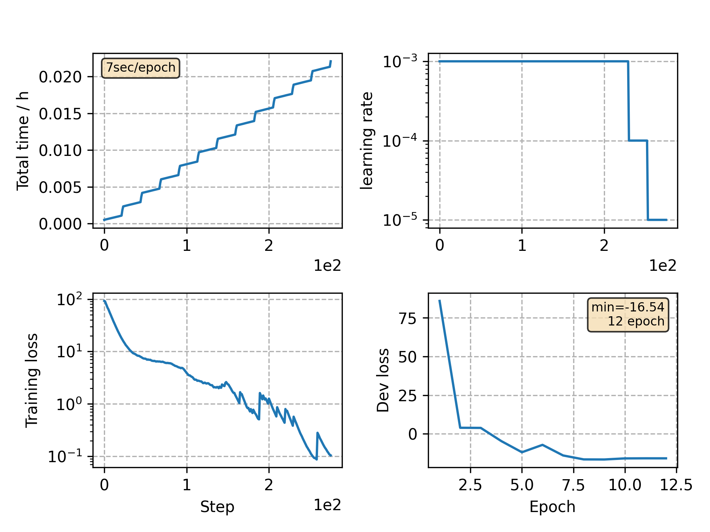

### Basic info

**This part is auto generated, add your details in Appendix**

* Model size/M: 9.29
* GPU info \[2\]
  * \[1\] NVIDIA GeForce GTX 1080 Ti
  * \[1\] NVIDIA GeForce GTX 1080

### Appendix

* This is a demo showing how to train a VGGBLSTM model on yesno dataset.

### WER
```
%WER 1.25 [ 3 / 240, 0 ins, 3 del, 0 sub ] exp/demo2/decode_test/wer_7_0.0
```

### Monitor figure

