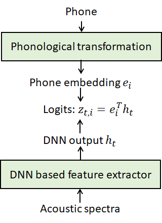

# 基于JoinAP的多语言/跨语言语音识别
**本文档介绍如何使用JoinAP模型进行多语言/跨语言语音识别的研究，推荐先阅读以下参考资料了解理论知识以及相关细节**：
- Chengrui Zhu, Keyu An, Huahuan Zheng and Zhijian Ou, "Multilingual and crosslingual speech recognition using phonological-vector based phone embeddings", IEEE Workshop on Automatic Speech Recognition and Understanding (ASRU), 2021. [pdf](http://oa.ee.tsinghua.edu.cn/~ouzhijian/pdf/ASRU21_JoinAP.pdf)
- [THU-SPMI@ASRU2021: 基于音位矢量的多语言与跨语言语音识别，促进多语言信息共享与迁移](https://mp.weixin.qq.com/s?__biz=MzU3MzgyNDMzMQ==&mid=2247484519&idx=1&sn=492cc4e098df0077fc51ecb163d8c8a4&chksm=fd3a8843ca4d015560d9cb3fcfc9e0741c0cd898ad69c7b94b6e092f60ee3e6db3c1f9ccf54d&mpshare=1&scene=1&srcid=0612RqU7DGRZG5XQqg0L2Le1&sharer_sharetime=1655005703359&sharer_shareid=96a0960dd6af6941d3216dad8f2d3a50&key=311fd5318431ff9c5328351edecbba7c5d812fe2ebfc0df6c234172e3cd3b056a5dc35c3c9476a894d7828f7932113f61f420f11bd98bd9f19a18dbbce60d74810202a96eb262756df24294667730f65015d74e3b84a12d358110afd52a3e26cd7bfd692bf4322094d61d031aab32954e42b0043521ae4d7a3ba8b52f177429f&ascene=1&uin=MjI2OTIxNjcxMA%3D%3D&devicetype=Windows+10+x64&version=6209051a&lang=zh_CN&exportkey=AxSPQ4EqXRXSVFCXOPz3zSc%3D&acctmode=0&pass_ticket=5FeYTkI0JWlQDdwbOw%2B90azniyK49b4eF6G1m7lzzoG4aLbog8BRp8ZMiC%2BnfXI5&wx_header=0)

**本文档将细化说明实验的每一步过程，包括数据获取，数据预处理，发音词典的生成(G2P)，音位矢量生成，模型训练测试等。**

* [数据获取及预处理](#数据获取及预处理)

* [发音词典](#发音词典)

* [音位矢量](#音位矢量)

* [训练及测试](#训练及测试)

## 数据获取及预处理

本文档中实验选择开源的[CommonVoice数据](https://commonvoice.mozilla.org/zh-CN/datasets)作为实验数据，针对CommonVoice 5.1中德语（750小时），法语（604小时），西班牙语（521小时），意大利语（167小时），波兰语（119小时）进行多语言以及跨语言语音识别的实验；这些开源数据可以直接下载得到。下载好的数据由音频及训练、验证、测试文本构成。

数据预处理阶段的代码位于CAT的[egs\commonvoice目录](https://github.com/thu-spmi/CAT/tree/master/egs/commonvoice)，其中 **local**下的脚本文件无需任何改动，只需要修改**run_mc.sh** 脚本文件即可。**run_mc.sh**脚本中**stage7**开始为JoinAP模型的训练部分，下面说明该脚本进行数据处理的前6部分。

```
lang=(de it fr es)
datadir=/path/to/cv-corpus-5.1-2020-06-22/

saved_dict="saved_dict"
dict_tmp=data/local/dict_tmp
```
**lang**决定训练的语言种类de（德语），it（意大利语），fr（法语），es（西班牙语），实验者可以根据自身研究需要选择不同语种来进行实验。**datadir**是存放训练数据的目录。

**saved_dict**存放完整发音词典，**dict_tmp**存放从文本数据中切分下的未注音的词典（注音部分后续会对其说明）。

```
if [ $stage -le 1 ] && [ $stop_stage -ge 1 ]; then
```
这部分代码仿照kaldi处理，主要生成**train,dev,test**下的**wav.scp,text,utt2spk,spk2utt**文件。

```
if [ $stage -le 2 ] && [ $stop_stage -ge 2 ]; then
```
这部分代码主要是针对Multilingual构建词典，加入噪音`NOISE`、人声噪声`SPOKEN_NOISE`、未知词`UNK`，创建数字编号的声学单元units.txt、数字编号的词典lexicon_numbers.txt、L.fst的输入符号集words.txt、L.fst的输出符号集token.txt，进而生成T.fst和L.fst文件。由data/train/text、dict/lexicon.txt，生成的语言模型G.fst。最后，组合生成一种语言的TLG.fst用于训练。

```
if [ $stage -le 3 ] && [ $stop_stage -ge 3 ]; then
```
这部分代码进行FBank特征提取和特征归一化。由于JoinAP模型基于VGGBLSTM系列模型，所以在位于`conf`目录下的fbank.conf中，设置16K和40维进行特征提取，并同时默认使用三倍数据增广。


```
if [ $stage -le 4 ] && [ $stop_stage -ge 4 ]; then
```
这部分代码主要是将单词序列转换为标签序列。


```
if [ $stage -le 5 ] && [ $stop_stage -ge 5 ]; then
```
这部分代码将训练以及测试数据加一阶和二阶差分以便于模型训练。

```
if [ $stage -le 6 ] && [ $stop_stage -ge 6 ]; then
```
这部分代码生成den_lm.fst。最后由den_lm.fst和标签文件出发，计算出标签序列$l$的对数概率 $logp(l)$，称为path weight，并整合到data/pickle下。

## 发音词典

由于CommonVoice数据没有提供相应的词典，所以需要实验者自己来生成。**run_mc.sh**在**stage1**步骤中有如下一条awk+sed命令：

`cat data/${train_set}/text | awk '{$1="";print $0}' | sed 's/ /\n/g' | sort -u >$dict_tmp/wordlist_${x}` 

这一命令在data/local/dict_tmp目录中生成de、fr、es、it未注音的词典（wordlist_de、wordlist_it、wordlist_es、wordlist_fr），接下来利用G2P工具对未注音的词典进行注音。

**以下说明G2P工具——Phonetisaurus G2P的安装以及使用**

**[Phonetisaurus G2P工具](https://github.com/AdolfVonKleist/Phonetisaurus)**

**安装**：创建一个目录用于Phonetisaurus G2P工具的安装
```
$ mkdir g2p
$ cd g2p/
```

下载并安装 OpenFst-1.7.2
```
$ wget http://www.openfst.org/twiki/pub/FST/FstDownload/openfst-1.7.2.tar.gz
$ tar -xvzf openfst-1.7.2.tar.gz
$ cd openfst-1.7.2
$ ./configure --enable-static --enable-shared --enable-far --enable-ngram-fsts
$ make -j
$ sudo make install
$ echo 'export LD_LIBRARY_PATH=${LD_LIBRARY_PATH}:/usr/local/lib:/usr/local/lib/fst' \
     >> ~/.bashrc
$ source ~/.bashrc
$ cd ..
```

从最新github-master用git下载最新的Phonetisaurus 并使用 python3 绑定进行编译：
```
$ git clone https://github.com/AdolfVonKleist/Phonetisaurus.git
$ cd Phonetisaurus
$ sudo pip3 install pybindgen
$ PYTHON=python3 ./configure --enable-python
$ make
$ sudo make install
$ cd python
$ cp ../.libs/Phonetisaurus.so .
$ sudo python3 setup.py install
$ cd ../..
```

获取并安装 mitlm 
```
$ git clone https://github.com/mitlm/mitlm.git
$ cd mitlm/
$ ./autogen.sh
$ make
$ sudo make install
$ cd ..
```

获取最新版本 CMUdict 的副本并清理一下：
```
$ mkdir example
$ cd example
$ wget https://raw.githubusercontent.com/cmusphinx/cmudict/master/cmudict.dict
$ cat cmudict.dict \
  | perl -pe 's/\([0-9]+\)//;
              s/\s+/ /g; s/^\s+//;
              s/\s+$//; @_ = split (/\s+/);
              $w = shift (@_);
              $_ = $w."\t".join (" ", @_)."\n";' \
  > cmudict.formatted.dict
```

使用包装的脚本训练具有默认参数的完整模型。注意：默认 python3 绑定编译：
```
$ phonetisaurus-train --lexicon cmudict.formatted.dict --seq2_del
```

至此，我们完成了Phonetisaurus G2P工具的安装！

**测试**：(test.wlist是未注音的词典)

```
$ phonetisaurus-apply --model train/model.fst --word_list test.wlist
```
test  t ˈɛ s t

jumbotron   dʒ ˈʌ m b əʊ t ɻ ɒ n

excellent  ə k s ə l ə n t

amazing  æ m ˈeɪ z ɪ ŋ

**Phonetisaurus G2P工具，可以利用一种语言的基于FST的G2P模型（简称G2P-FST）来对这种语言中的词进行注音**。德语、法语、西班牙、意大利语的已训练好的G2P-FST模型可以在下面网站找到：

**[LanguageNet Grapheme-to-Phoneme Transducers (G2P-FST)](https://github.com/uiuc-sst/g2ps)**

用git下载已经训练好的G2P-FST模型并测试
```
$ git clone https://github.com/uiuc-sst/g2ps
$ phonetisaurus-g2pfst --model=g2ps/models/akan.fst --word=ahyiakwa
```

**注意**：models下的fst文件需要解压。

运行以下脚本命令可以生成每种语言的发音词典：

```
g2ps=g2ps/models/ # g2p model 的路径
dict_tmp=local/dict_tmp/ # 存放未注音及注音完成后存放目录
    phonetisaurus-apply --model $g2ps/french_8_4_2.fst --word_list $dict_tmp/wordlist_fr > $dict_tmp/lexicon_fr
    phonetisaurus-apply --model $g2ps/german_8_4_2.fst --word_list $dict_tmp/wordlist_de > $dict_tmp/lexicon_de
    phonetisaurus-apply --model $g2ps/spanish_4_3_2.fst --word_list $dict_tmp/wordlist_es > $dict_tmp/lexicon_es
    phonetisaurus-apply --model $g2ps/italian_8_2_3.fst --word_list $dict_tmp/wordlist_it > $dict_tmp/lexicon_it
```
至此，dict_tmp目录下已经生成我们所需要的发音词典。

## 音位矢量

在多语言声学模型训练时，为了促进多语言信息共享与迁移，[JoinAP论文](http://oa.ee.tsinghua.edu.cn/~ouzhijian/pdf/ASRU21_JoinAP.pdf)引入音位矢量（phonological-vector）来表示每个音素。音位矢量的构建用到了panphon工具包。panphon工具包定义了全部 IPA 音素符号到发音特征（Articulatory Feature, AF）的映射；这样可以根据 IPA 音素得到它的发音特征表达，进而编码成51维音位矢量（描述见后）。

JoinAP（Joining of Acoustics and Phonology）方法，意为结合了声学（Acoustics）和音系学（Phonology）的方法。
从顶往下，将音素$i$的音位矢量经过变换（phonological transformation），得到音素嵌入（phone embedding）；自底向上，声学深度神经网络（Deep Neural Network、DNN）提取出高层声学特征$h_t$。将音素$i$的phone embedding与声学特征$h_t$做内积，计算出$t$时刻下音素$i$的匹配得分（logit），便可用于基于CTC或CTC-CRF的语音识别。不难看出，JoinAP方法引入音位矢量，对声学神经网络的最后输出线性层进行了修改。

<p align="center">
  
</p>

**[panphon工具包](https://github.com/dmort27/panphon)**

我们需要对每个音素单元进行手动标记出其音位矢量。panphon一共提供24个发音特征（AF），每种发音特征分别有“+”、“-”、“0”三种取值；我们将**其中“+”被编码“10”，“-”被编码为“01”，“00”则表示“0”符号**。这样，24维的发音特征被编码为了 48 维的矢量；再加上对三个特殊单元：blk（空）、spn（说话噪音）、nsn（自然噪音）的3维编码，便得到51维音位矢量。

**注意**：映射表中未出现的音素，称之为集外音素。对于作为分隔符号或停顿语气等对训练无影响的音素可以直接全部标记为0；其它集外音素将其映射到与其它声学上最相似的音素。

**[panphon提供的IPA音素到发音特征的映射表(IPA2AF)](https://github.com/dmort27/panphon/blob/master/panphon/data/ipa_all.csv)**

我们可以通过IPA2AF映射表对每个音素进行编码，得到音位矢量。 `以下展示以德语为例：`

|    |   token | IPA   |   syl+ |   syl- |   son+ |   son- |   cons+ |   cons- |   cont+ |   cont- |   delrel+ |   delrel- |   lat+ |   lat- |   nas+ |   nas- |   srtid+ |   strid- |   voi+ |   voi- |   sg+ |   sg- |   cg+ |   cg- |   ant+ |   ant- |   cor+ |   cor- |   distr+ |   distr- |   lab+ |   lab- |   hi+ |   hi- |   lo+ |   lo- |   back+ |   back- |   round+ |   round- |   velaric+ |   velaric- |   tense+ |   tense- |   long+ |   long- |   hitone+ |   hitone- |   hireg+ |   hireg- |   blk |   nsn |   spn |
|---:|--------:|:------|-------:|-------:|-------:|-------:|--------:|--------:|--------:|--------:|----------:|----------:|-------:|-------:|-------:|-------:|---------:|---------:|-------:|-------:|------:|------:|------:|------:|-------:|-------:|-------:|-------:|---------:|---------:|-------:|-------:|------:|------:|------:|------:|--------:|--------:|---------:|---------:|-----------:|-----------:|---------:|---------:|--------:|--------:|----------:|----------:|---------:|---------:|------:|------:|------:|
|  0 |       1 | BLK |      0 |      0 |      0 |      0 |       0 |       0 |       0 |       0 |         0 |         0 |      0 |      0 |      0 |      0 |        0 |        0 |      0 |      0 |     0 |     0 |     0 |     0 |      0 |      0 |      0 |      0 |        0 |        0 |      0 |      0 |     0 |     0 |     0 |     0 |       0 |       0 |        0 |        0 |          0 |          0 |        0 |        0 |       0 |       0 |         0 |         0 |        0 |        0 |     1 |     0 |     0 |
|  1 |       2 | NSN |      0 |      0 |      0 |      0 |       0 |       0 |       0 |       0 |         0 |         0 |      0 |      0 |      0 |      0 |        0 |        0 |      0 |      0 |     0 |     0 |     0 |     0 |      0 |      0 |      0 |      0 |        0 |        0 |      0 |      0 |     0 |     0 |     0 |     0 |       0 |       0 |        0 |        0 |          0 |          0 |        0 |        0 |       0 |       0 |         0 |         0 |        0 |        0 |     0 |     1 |     0 |
|  2 |       3 | SPN |      0 |      0 |      0 |      0 |       0 |       0 |       0 |       0 |         0 |         0 |      0 |      0 |      0 |      0 |        0 |        0 |      0 |      0 |     0 |     0 |     0 |     0 |      0 |      0 |      0 |      0 |        0 |        0 |      0 |      0 |     0 |     0 |     0 |     0 |       0 |       0 |        0 |        0 |          0 |          0 |        0 |        0 |       0 |       0 |         0 |         0 |        0 |        0 |     0 |     0 |     1 |
|  3 |       4 | #     |      0 |      0 |      0 |      0 |       0 |       0 |       0 |       0 |         0 |         0 |      0 |      0 |      0 |      0 |        0 |        0 |      0 |      0 |     0 |     0 |     0 |     0 |      0 |      0 |      0 |      0 |        0 |        0 |      0 |      0 |     0 |     0 |     0 |     0 |       0 |       0 |        0 |        0 |          0 |          0 |        0 |        0 |       0 |       0 |         0 |         0 |        0 |        0 |     0 |     0 |     0 |
|  4 |       5 | 1     |      0 |      0 |      0 |      0 |       0 |       0 |       0 |       0 |         0 |         0 |      0 |      0 |      0 |      0 |        0 |        0 |      0 |      0 |     0 |     0 |     0 |     0 |      0 |      0 |      0 |      0 |        0 |        0 |      0 |      0 |     0 |     0 |     0 |     0 |       0 |       0 |        0 |        0 |          0 |          0 |        0 |        0 |       0 |       0 |         0 |         0 |        0 |        0 |     0 |     0 |     0 |
|  5 |       6 | 7     |      0 |      0 |      0 |      0 |       0 |       0 |       0 |       0 |         0 |         0 |      0 |      0 |      0 |      0 |        0 |        0 |      0 |      0 |     0 |     0 |     0 |     0 |      0 |      0 |      0 |      0 |        0 |        0 |      0 |      0 |     0 |     0 |     0 |     0 |       0 |       0 |        0 |        0 |          0 |          0 |        0 |        0 |       0 |       0 |         0 |         0 |        0 |        0 |     0 |     0 |     0 |
|  6 |       7 | a     |      1 |      0 |      1 |      0 |       0 |       1 |       1 |       0 |         0 |         1 |      0 |      1 |      0 |      1 |        0 |        0 |      1 |      0 |     0 |     1 |     0 |     1 |      0 |      0 |      0 |      1 |        0 |        0 |      0 |      1 |     0 |     1 |     1 |     0 |       0 |       1 |        0 |        1 |          0 |          1 |        1 |        0 |       0 |       1 |         0 |         0 |        0 |        0 |     0 |     0 |     0 |
|  7 |       8 | b     |      0 |      1 |      0 |      1 |       1 |       0 |       0 |       1 |         0 |         1 |      0 |      1 |      0 |      1 |        0 |        0 |      1 |      0 |     0 |     1 |     0 |     1 |      1 |      0 |      0 |      1 |        0 |        0 |      1 |      0 |     0 |     1 |     0 |     1 |       0 |       1 |        0 |        1 |          0 |          1 |        0 |        0 |       0 |       1 |         0 |         0 |        0 |        0 |     0 |     0 |     0 |
|  8 |       9 | d     |      0 |      1 |      0 |      1 |       1 |       0 |       0 |       1 |         0 |         1 |      0 |      1 |      0 |      1 |        0 |        0 |      1 |      0 |     0 |     1 |     0 |     1 |      1 |      0 |      1 |      0 |        0 |        1 |      0 |      1 |     0 |     1 |     0 |     1 |       0 |       1 |        0 |        1 |          0 |          1 |        0 |        0 |       0 |       1 |         0 |         0 |        0 |        0 |     0 |     0 |     0 |
|  9 |      10 | e     |      1 |      0 |      1 |      0 |       0 |       1 |       1 |       0 |         0 |         1 |      0 |      1 |      0 |      1 |        0 |        0 |      1 |      0 |     0 |     1 |     0 |     1 |      0 |      0 |      0 |      1 |        0 |        0 |      0 |      1 |     0 |     1 |     0 |     1 |       0 |       1 |        0 |        1 |          0 |          1 |        1 |        0 |       0 |       1 |         0 |         0 |        0 |        0 |     0 |     0 |     0 |
| 10 |      11 | f     |      0 |      1 |      0 |      1 |       1 |       0 |       1 |       0 |         0 |         1 |      0 |      1 |      0 |      1 |        1 |        0 |      0 |      1 |     0 |     1 |     0 |     1 |      1 |      0 |      0 |      1 |        0 |        0 |      1 |      0 |     0 |     1 |     0 |     1 |       0 |       1 |        0 |        1 |          0 |          1 |        0 |        0 |       0 |       1 |         0 |         0 |        0 |        0 |     0 |     0 |     0 |
| 11 |      12 | g     |      0 |      1 |      0 |      1 |       1 |       0 |       0 |       1 |         0 |         1 |      0 |      1 |      0 |      1 |        0 |        0 |      1 |      0 |     0 |     1 |     0 |     1 |      0 |      1 |      0 |      1 |        0 |        0 |      0 |      1 |     1 |     0 |     0 |     1 |       1 |       0 |        0 |        1 |          0 |          1 |        0 |        0 |       0 |       1 |         0 |         0 |        0 |        0 |     0 |     0 |     0 |
| 12 |      13 | h     |      0 |      1 |      1 |      0 |       1 |       0 |       1 |       0 |         0 |         1 |      0 |      1 |      0 |      1 |        0 |        0 |      0 |      1 |     0 |     1 |     0 |     1 |      0 |      1 |      0 |      1 |        0 |        0 |      0 |      1 |     0 |     1 |     0 |     1 |       0 |       1 |        0 |        1 |          0 |          1 |        0 |        0 |       0 |       1 |         0 |         0 |        0 |        0 |     0 |     0 |     0 |
| 13 |      14 | i     |      1 |      0 |      1 |      0 |       0 |       1 |       1 |       0 |         0 |         1 |      0 |      1 |      0 |      1 |        0 |        0 |      1 |      0 |     0 |     1 |     0 |     1 |      0 |      0 |      0 |      1 |        0 |        0 |      0 |      1 |     1 |     0 |     0 |     1 |       0 |       1 |        0 |        1 |          0 |          1 |        1 |        0 |       0 |       1 |         0 |         0 |        0 |        0 |     0 |     0 |     0 |
| 14 |      15 | j     |      0 |      1 |      1 |      0 |       0 |       1 |       1 |       0 |         0 |         1 |      0 |      1 |      0 |      1 |        0 |        0 |      1 |      0 |     0 |     1 |     0 |     1 |      0 |      1 |      0 |      1 |        0 |        0 |      0 |      1 |     1 |     0 |     0 |     1 |       0 |       1 |        0 |        1 |          0 |          1 |        0 |        0 |       0 |       1 |         0 |         0 |        0 |        0 |     0 |     0 |     0 |
| 15 |      16 | k     |      0 |      1 |      0 |      1 |       1 |       0 |       0 |       1 |         0 |         1 |      0 |      1 |      0 |      1 |        0 |        0 |      0 |      1 |     0 |     1 |     0 |     1 |      0 |      1 |      0 |      1 |        0 |        0 |      0 |      1 |     1 |     0 |     0 |     1 |       1 |       0 |        0 |        1 |          0 |          1 |        0 |        0 |       0 |       1 |         0 |         0 |        0 |        0 |     0 |     0 |     0 |
| 16 |      17 | l     |      0 |      1 |      1 |      0 |       1 |       0 |       1 |       0 |         0 |         1 |      1 |      0 |      0 |      1 |        0 |        0 |      1 |      0 |     0 |     1 |     0 |     1 |      1 |      0 |      1 |      0 |        0 |        1 |      0 |      1 |     0 |     1 |     0 |     1 |       0 |       1 |        0 |        1 |          0 |          1 |        0 |        0 |       0 |       1 |         0 |         0 |        0 |        0 |     0 |     0 |     0 |
| 17 |      18 | m     |      0 |      1 |      1 |      0 |       1 |       0 |       0 |       1 |         0 |         1 |      0 |      1 |      1 |      0 |        0 |        0 |      1 |      0 |     0 |     1 |     0 |     1 |      1 |      0 |      0 |      1 |        0 |        0 |      1 |      0 |     0 |     1 |     0 |     1 |       0 |       1 |        0 |        1 |          0 |          1 |        0 |        0 |       0 |       1 |         0 |         0 |        0 |        0 |     0 |     0 |     0 |
| 18 |      19 | n     |      0 |      1 |      1 |      0 |       1 |       0 |       0 |       1 |         0 |         1 |      0 |      1 |      1 |      0 |        0 |        0 |      1 |      0 |     0 |     1 |     0 |     1 |      1 |      0 |      1 |      0 |        0 |        1 |      0 |      1 |     0 |     1 |     0 |     1 |       0 |       1 |        0 |        1 |          0 |          1 |        0 |        0 |       0 |       1 |         0 |         0 |        0 |        0 |     0 |     0 |     0 |
| 19 |      20 | o     |      1 |      0 |      1 |      0 |       0 |       1 |       1 |       0 |         0 |         1 |      0 |      1 |      0 |      1 |        0 |        0 |      1 |      0 |     0 |     1 |     0 |     1 |      0 |      0 |      0 |      1 |        0 |        0 |      0 |      1 |     0 |     1 |     0 |     1 |       1 |       0 |        1 |        0 |          0 |          1 |        1 |        0 |       0 |       1 |         0 |         0 |        0 |        0 |     0 |     0 |     0 |
| 20 |      21 | p     |      0 |      1 |      0 |      1 |       1 |       0 |       0 |       1 |         0 |         1 |      0 |      1 |      0 |      1 |        0 |        0 |      0 |      1 |     0 |     1 |     0 |     1 |      1 |      0 |      0 |      1 |        0 |        0 |      1 |      0 |     0 |     1 |     0 |     1 |       0 |       1 |        0 |        1 |          0 |          1 |        0 |        0 |       0 |       1 |         0 |         0 |        0 |        0 |     0 |     0 |     0 |
| 21 |      22 | r     |      0 |      1 |      1 |      0 |       1 |       0 |       1 |       0 |         0 |         0 |      0 |      1 |      0 |      1 |        0 |        0 |      1 |      0 |     0 |     1 |     0 |     1 |      1 |      0 |      1 |      0 |        0 |        1 |      0 |      1 |     0 |     0 |     0 |     0 |       0 |       0 |        0 |        1 |          0 |          1 |        0 |        0 |       0 |       1 |         0 |         0 |        0 |        0 |     0 |     0 |     0 |
| 22 |      23 | s     |      0 |      1 |      0 |      1 |       1 |       0 |       1 |       0 |         0 |         1 |      0 |      1 |      0 |      1 |        1 |        0 |      0 |      1 |     0 |     1 |     0 |     1 |      1 |      0 |      1 |      0 |        0 |        1 |      0 |      1 |     0 |     1 |     0 |     1 |       0 |       1 |        0 |        1 |          0 |          1 |        0 |        0 |       0 |       1 |         0 |         0 |        0 |        0 |     0 |     0 |     0 |
| 23 |      24 | t     |      0 |      1 |      0 |      1 |       1 |       0 |       0 |       1 |         0 |         1 |      0 |      1 |      0 |      1 |        0 |        0 |      0 |      1 |     0 |     1 |     0 |     1 |      1 |      0 |      1 |      0 |        0 |        1 |      0 |      1 |     0 |     1 |     0 |     1 |       0 |       1 |        0 |        1 |          0 |          1 |        0 |        0 |       0 |       1 |         0 |         0 |        0 |        0 |     0 |     0 |     0 |
| 24 |      25 | ts    |      0 |      1 |      0 |      1 |       1 |       0 |       0 |       1 |         1 |         0 |      0 |      1 |      0 |      1 |        1 |        0 |      0 |      1 |     0 |     1 |     0 |     1 |      1 |      0 |      1 |      0 |        0 |        1 |      0 |      1 |     0 |     1 |     0 |     1 |       0 |       1 |        0 |        1 |          0 |          1 |        0 |        0 |       0 |       1 |         0 |         0 |        0 |        0 |     0 |     0 |     0 |
| 25 |      26 | u     |      1 |      0 |      1 |      0 |       0 |       1 |       1 |       0 |         0 |         1 |      0 |      1 |      0 |      1 |        0 |        0 |      1 |      0 |     0 |     1 |     0 |     1 |      0 |      0 |      0 |      1 |        0 |        0 |      1 |      0 |     1 |     0 |     0 |     1 |       1 |       0 |        1 |        0 |          0 |          1 |        1 |        0 |       0 |       1 |         0 |         0 |        0 |        0 |     0 |     0 |     0 |
| 26 |      27 | v     |      0 |      1 |      0 |      1 |       1 |       0 |       1 |       0 |         0 |         1 |      0 |      1 |      0 |      1 |        1 |        0 |      1 |      0 |     0 |     1 |     0 |     1 |      1 |      0 |      0 |      1 |        0 |        0 |      1 |      0 |     0 |     1 |     0 |     1 |       0 |       1 |        0 |        1 |          0 |          1 |        0 |        0 |       0 |       1 |         0 |         0 |        0 |        0 |     0 |     0 |     0 |
| 27 |      28 | w     |      0 |      1 |      1 |      0 |       0 |       1 |       1 |       0 |         0 |         1 |      0 |      1 |      0 |      1 |        0 |        0 |      1 |      0 |     0 |     1 |     0 |     1 |      0 |      1 |      0 |      1 |        0 |        0 |      1 |      0 |     1 |     0 |     0 |     1 |       1 |       0 |        1 |        0 |          0 |          1 |        0 |        0 |       0 |       1 |         0 |         0 |        0 |        0 |     0 |     0 |     0 |
| 28 |      29 | y     |      1 |      0 |      1 |      0 |       0 |       1 |       1 |       0 |         0 |         1 |      0 |      1 |      0 |      1 |        0 |        0 |      1 |      0 |     0 |     1 |     0 |     1 |      0 |      0 |      0 |      1 |        0 |        0 |      1 |      0 |     1 |     0 |     0 |     1 |       0 |       1 |        1 |        0 |          0 |          1 |        1 |        0 |       0 |       1 |         0 |         0 |        0 |        0 |     0 |     0 |     0 |
| 29 |      30 | z     |      0 |      1 |      0 |      1 |       1 |       0 |       1 |       0 |         0 |         1 |      0 |      1 |      0 |      1 |        1 |        0 |      1 |      0 |     0 |     1 |     0 |     1 |      1 |      0 |      1 |      0 |        0 |        1 |      0 |      1 |     0 |     1 |     0 |     1 |       0 |       1 |        0 |        1 |          0 |          1 |        0 |        0 |       0 |       1 |         0 |         0 |        0 |        0 |     0 |     0 |     0 |
| 30 |      31 | ç     |      0 |      1 |      0 |      1 |       1 |       0 |       1 |       0 |         0 |         1 |      0 |      1 |      0 |      1 |        0 |        0 |      0 |      1 |     0 |     1 |     0 |     1 |      0 |      1 |      0 |      1 |        0 |        0 |      0 |      1 |     1 |     0 |     0 |     1 |       0 |       1 |        0 |        1 |          0 |          1 |        0 |        0 |       0 |       1 |         0 |         0 |        0 |        0 |     0 |     0 |     0 |
| 31 |      32 | ø     |      1 |      0 |      1 |      0 |       0 |       1 |       1 |       0 |         0 |         1 |      0 |      1 |      0 |      1 |        0 |        0 |      1 |      0 |     0 |     1 |     0 |     1 |      0 |      0 |      0 |      1 |        0 |        0 |      0 |      1 |     0 |     1 |     0 |     1 |       0 |       1 |        1 |        0 |          0 |          1 |        1 |        0 |       0 |       1 |         0 |         0 |        0 |        0 |     0 |     0 |     0 |
| 32 |      33 | ŋ     |      0 |      1 |      1 |      0 |       1 |       0 |       0 |       1 |         0 |         1 |      0 |      1 |      1 |      0 |        0 |        0 |      1 |      0 |     0 |     1 |     0 |     1 |      0 |      1 |      0 |      1 |        0 |        0 |      0 |      1 |     1 |     0 |     0 |     1 |       1 |       0 |        0 |        1 |          0 |          1 |        0 |        0 |       0 |       1 |         0 |         0 |        0 |        0 |     0 |     0 |     0 |
| 33 |      34 | œ     |      1 |      0 |      1 |      0 |       0 |       1 |       1 |       0 |         0 |         1 |      0 |      1 |      0 |      1 |        0 |        0 |      1 |      0 |     0 |     1 |     0 |     1 |      0 |      0 |      0 |      1 |        0 |        0 |      0 |      1 |     0 |     1 |     0 |     1 |       0 |       1 |        1 |        0 |          0 |          1 |        0 |        1 |       0 |       1 |         0 |         0 |        0 |        0 |     0 |     0 |     0 |
| 34 |      35 | ɔ     |      1 |      0 |      1 |      0 |       0 |       1 |       1 |       0 |         0 |         1 |      0 |      1 |      0 |      1 |        0 |        0 |      1 |      0 |     0 |     1 |     0 |     1 |      0 |      0 |      0 |      1 |        0 |        0 |      0 |      1 |     0 |     1 |     0 |     1 |       1 |       0 |        1 |        0 |          0 |          1 |        0 |        1 |       0 |       1 |         0 |         0 |        0 |        0 |     0 |     0 |     0 |
| 35 |      36 | ɛ     |      1 |      0 |      1 |      0 |       0 |       1 |       1 |       0 |         0 |         1 |      0 |      1 |      0 |      1 |        0 |        0 |      1 |      0 |     0 |     1 |     0 |     1 |      0 |      0 |      0 |      1 |        0 |        0 |      0 |      1 |     0 |     1 |     0 |     1 |       0 |       1 |        0 |        1 |          0 |          1 |        0 |        1 |       0 |       1 |         0 |         0 |        0 |        0 |     0 |     0 |     0 |
| 36 |      37 | ɡ     |      0 |      1 |      0 |      1 |       1 |       0 |       0 |       1 |         0 |         1 |      0 |      1 |      0 |      1 |        0 |        0 |      1 |      0 |     0 |     1 |     0 |     1 |      0 |      1 |      0 |      1 |        0 |        0 |      0 |      1 |     1 |     0 |     0 |     1 |       1 |       0 |        0 |        1 |          0 |          1 |        0 |        0 |       0 |       1 |         0 |         0 |        0 |        0 |     0 |     0 |     0 |
| 37 |      38 | ɪ     |      1 |      0 |      1 |      0 |       0 |       1 |       1 |       0 |         0 |         1 |      0 |      1 |      0 |      1 |        0 |        0 |      1 |      0 |     0 |     1 |     0 |     1 |      0 |      0 |      0 |      1 |        0 |        0 |      0 |      1 |     1 |     0 |     0 |     1 |       0 |       1 |        0 |        1 |          0 |          1 |        0 |        1 |       0 |       1 |         0 |         0 |        0 |        0 |     0 |     0 |     0 |
| 38 |      39 | ʁ     |      0 |      1 |      0 |      1 |       1 |       0 |       1 |       0 |         0 |         1 |      0 |      1 |      0 |      1 |        0 |        0 |      1 |      0 |     0 |     1 |     0 |     1 |      0 |      1 |      0 |      1 |        0 |        0 |      0 |      1 |     0 |     1 |     0 |     1 |       1 |       0 |        0 |        1 |          0 |          1 |        0 |        0 |       0 |       1 |         0 |         0 |        0 |        0 |     0 |     0 |     0 |
| 39 |      40 | ʃ     |      0 |      1 |      0 |      1 |       1 |       0 |       1 |       0 |         0 |         1 |      0 |      1 |      0 |      1 |        1 |        0 |      0 |      1 |     0 |     1 |     0 |     1 |      0 |      1 |      1 |      0 |        1 |        0 |      0 |      1 |     0 |     1 |     0 |     1 |       0 |       1 |        0 |        1 |          0 |          1 |        0 |        0 |       0 |       1 |         0 |         0 |        0 |        0 |     0 |     0 |     0 |
| 40 |      41 | ʊ     |      1 |      0 |      1 |      0 |       0 |       1 |       1 |       0 |         0 |         1 |      0 |      1 |      0 |      1 |        0 |        0 |      1 |      0 |     0 |     1 |     0 |     1 |      0 |      0 |      0 |      1 |        0 |        0 |      0 |      1 |     1 |     0 |     0 |     1 |       1 |       0 |        1 |        0 |          0 |          1 |        0 |        1 |       0 |       1 |         0 |         0 |        0 |        0 |     0 |     0 |     0 |
| 41 |      42 | ʏ     |      1 |      0 |      1 |      0 |       0 |       1 |       1 |       0 |         0 |         1 |      0 |      1 |      0 |      1 |        0 |        0 |      1 |      0 |     0 |     1 |     0 |     1 |      0 |      0 |      0 |      1 |        0 |        0 |      0 |      1 |     1 |     0 |     0 |     1 |       0 |       1 |        1 |        0 |          0 |          1 |        0 |        1 |       0 |       1 |         0 |         0 |        0 |        0 |     0 |     0 |     0 |
| 42 |      43 | ʒ     |      0 |      1 |      0 |      1 |       1 |       0 |       1 |       0 |         0 |         1 |      0 |      1 |      0 |      1 |        1 |        0 |      1 |      0 |     0 |     1 |     0 |     1 |      0 |      1 |      1 |      0 |        1 |        0 |      0 |      1 |     0 |     1 |     0 |     1 |       0 |       1 |        0 |        1 |          0 |          1 |        0 |        0 |       0 |       1 |         0 |         0 |        0 |        0 |     0 |     0 |     0 |


**手动编码完成后，可将其转换成`numpy`格式文件用来存储诸音素的音位矢量（以下称pv文件），以便于模型训练。**

```
$ pip install numpy
$ import numpy as np
$ np.save('de.npy',path)
```

使用numpy读取音位矢量：
```
$import numpy as np
$de=np.load('de.npy')
$de

array( [[0, 0, 0, ..., 1, 0, 0],

     [0, 0, 0, ..., 0, 1, 0],
     
     [0, 0, 0, ..., 0, 0, 1],
           ...,
     [1, 0, 1, ..., 0, 0, 0],
       
     [1, 0, 1, ..., 0, 0, 0],
     
     [0, 1, 0, ..., 0, 0, 0]], dtype=int64)
```

至此，完成音位矢量的构建，具体流程可概括如下：


## 训练及测试

训练及测试部分具体可以参考[CAT-JoinAP](https://github.com/thu-spmi/CAT/blob/master/joinap.md)官方说明，下面只对**JoinAP-Linear**作为演示。

**训练代码**

```
PARENTDIR='.'
dir="exp/mc_linear/"
DATAPATH=$PARENTDIR/data/
mkdir -p $dir

if [ $stage -le 7 ] && [ $stop_stage -ge 7 ]; then
    unset CUDA_VISIBLE_DEVICES
    
    if [[ $NODE == 0 && ! -f $dir/scripts.tar.gz ]]; then
        echo ""
        tar -zcf $dir/scripts.tar.gz $(readlink ctc-crf) $0
    elif [ $NODE == 0 ]; then
        echo ""
        echo "'$dir/scripts.tar.gz' already exists."
        echo "If you want to update it, please manually rm it then re-run this script."
    fi

  # uncomment the following line if you want to use specified GPUs
    CUDA_VISIBLE_DEVICES=0,1,2,3,4                    \
    python3 ctc-crf/train.py --seed=0               \
        --world-size 1 --rank $NODE                 \
        --mc-train-pv=./embedding/mul.npy            \
        --batch_size=128                            \
        --dir=$dir                                  \
        --config=$dir/config.json         \
        --trset=data/pickle/train.pickle            \
        --devset=data/pickle/dev.pickle             \
        --data=$DATAPATH                            \
        || exit 1
fi

```
在CAT中，JoinAP-Linear多语言训练与单语言训练基本相同，唯一区别在于添加了`--mc-train-pv`这个参数，用于为前面构建的多语言的音位矢量`numpy`文件来指定路径。

**Finetune代码**

```
finetune_dir="exp/mc_linear_finetune_de/"
if [ $stage -le 8 ] && [ $stop_stage -ge 8 ]; then
    # finetune
    unset CUDA_VISIBLE_DEVICES
    
    if [[ $NODE == 0 && ! -f $dir/scripts.tar.gz ]]; then
        echo ""
        tar -zcf $dir/scripts.tar.gz $(readlink ctc-crf) $0
    elif [ $NODE == 0 ]; then
        echo ""
        echo "'$dir/scripts.tar.gz' already exists."
        echo "If you want to update it, please manually rm it then re-run this script."
    fi

    CUDA_VISIBLE_DEVICES=0,1,2,3,4                    \
    python3 ctc-crf/train.py --seed=0               \
        --world-size 1 --rank $NODE                 \
        --batch_size=128                            \
	    --grad-accum-fold=2                           \
        --mc-train-pv=./embedding/mul.npy            \
        --resume=$dir/ckpt/bestckpt.pt              \
        --den-lm=data/den_meta_de/den_lm.fst        \
        --mc-conf=./conf/mc_linear_finetune_de.json    \
        --trset=data/pickle/train_de.pickle         \
        --devset=data/pickle/dev_de.pickle          \
        --dir=$finetune_dir                         \
        --config=$dir/config.json                   \
        --data=data/train_de || exit 1;
fi

```
Finetune是对目标语言（de、fr、es、it）进行微调。测试时，可以不进行微调直接测试；实验表明经过在各目标语言的数据上进行微调，可以提高对目标语言的语音识别准确率。

`--grad-accum-fold` 梯度累加（默认为1），等效于增加batch_size。

`mc-conf` 用来指定conf目录下用于相关参数配置的json文件路径。该json文件格式如下：

```
{
    "src_token": "./data/lang_phn/tokens.txt",
    "des_token": "./data/lang_phn_de/tokens.txt",
    "P": "./embedding/de.npy",
    "hdim": 640,
    "odim": 43, 
    "lr": 1e-5,
    "mode": "joinap_linear",
    "usg": "finetune"
}

```
* `src_token`：原始模型单元
* `des_token`: 目标语言单元
* `P`: finetune时目标语言的音位矢量pv文件
* `lr`: 模型微调时的学习率
* `hdim`：隐含层维度
* `odim`：目标语言的音素集数量
* `mode`: 三种模型类型 `["flat_phone", "joinap_linear", "joinap_nonlinear"]`
* `usg`: `["fientune", "zero-shot-eval", "few-shot-eval", "multi-eval", "multi-finetune-eval"]`；Finetune时默认选择`finetune`即可。

**测试代码**


```
nj=20

if [ $stage -le 9 ] && [ $stop_stage -ge 9 ]; then
    for lang in de; do
        scp=data/all_ark/test_${lang}.scp
        ark_dir=$finetune_dir/decode_${lang}_test_bd_tgpr/logits
        mkdir -p $ark_dir
        CUDA_VISIBLE_DEVICES=0,3            \
        python3 ctc-crf/calculate_logits.py                 \
            --mc-conf=./conf/mc_linear_finetune_de_eval.json                   \
            --mc-train-pv=./embedding/de.npy            \
            --resume=$finetune_dir/ckpt/bestckpt.pt                     \
            --config=$finetune_dir/config.json                       \
            --nj=$nj --input_scp=$scp                       \
            --output_dir=$ark_dir                           \
            || exit 1
        
        ctc-crf/decode.sh  --stage 1 --cmd "$decode_cmd" --nj $nj --acwt 1.0 data/lang_phn_${lang}_test_bd_tgpr \
            data/test_${lang} data/all_ark/test_${lang}.ark $finetune_dir/decode_${lang}_test_bd_tgpr || exit 1
    done
fi
```
**注意**：这时`mc-train-pv`要指定目标语言（de、es、fr、it之一）的音位矢量pv文件

`--mc-conf` 仍然用来指定conf目录下用于相关参数配置的json文件路径。该json文件格式如下：

```
{
    "src_token": "./data/lang_phn/tokens.txt",
    "des_token": "./data/lang_phn_de/tokens.txt",
    "P": "./embedding/de.npy",
    "hdim": 640,
    "odim": 43,
    "lr": 1e-5,
    "mode": "joinap_linear",
    "usg": "multi-finetune-eval"
}
```
与Finetune时不同的是`usg`字段需要修改，其不同取字表示不同的意思：

* `multi-finetune-eval` 表示选择目标语言(de,fr,es,it)其中之一经过微调(Finetune)后多语言(de,fr,es,it)测试
* `multi-eval` 表示目标语言(de,fr,es,it)不经过任何微调(Finetune)的多语言(de,fr,es,it)测试
* `few-shot-eval` 表示训练好的多语言模型(de,fr,es,it)针对一种新语言(egs:pl,pt)进行微调(Finetune)后的跨语言测试
* `zero-shot-eval` 表示训练好的多语言模型(de,fr,es,it)针对新语言不进行任何微调(Finetune)跨语言测试

**至此我们完成基于JoinAP的多语言/跨语言语音识别实验的全部步骤！**

✈-🐱‍🏍
